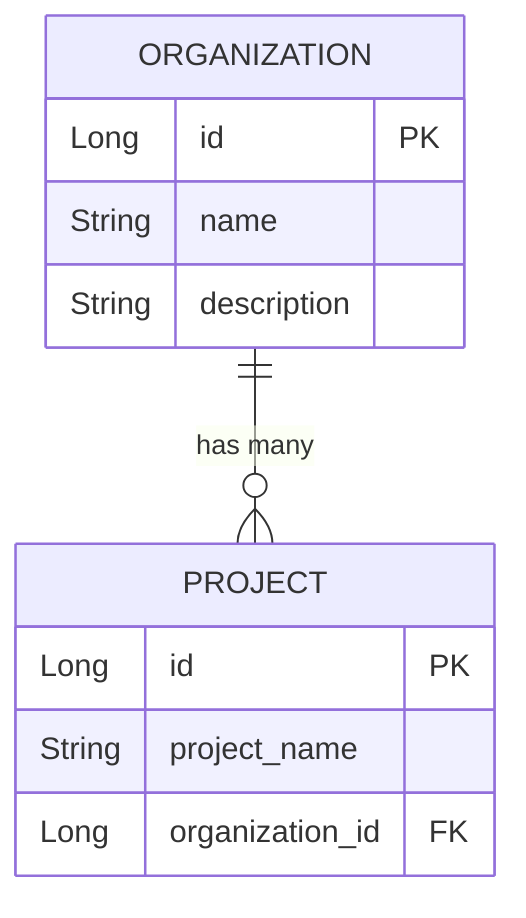

# Design Document

## Overview
本機能は、Spring BootとMyBatisを使用したProject/Organization管理システムの基本的なCRUD機能を提供し、MyBatisの学習環境を実現します。XMLマッパーとアノテーションマッパーの両方のアプローチでデータベース操作を実装することで、MyBatisのSQLマッピング機能、トランザクション管理、エンティティ間のリレーションシップを実践的に学習できます。

**Purpose**: MyBatisのXMLベースSQLマッピングとアノテーションベースマッピングの両方を実装し、CRUD操作、リレーションシップ管理、トランザクション制御の理解を深める学習環境を提供する。

**Users**: Java開発者がMyBatisフレームワークの基本から応用まで段階的に学習するために利用する。

**Impact**: 既存のシンプルなMavenプロジェクトを、Spring Boot + MyBatis + H2データベースの統合学習環境に変換する。

### Goals
- MyBatis Spring Boot Starterを使用したSpring BootとMyBatisの統合
- XMLマッパーによる基本的なCRUD操作とリレーションシップマッピングの実装
- アノテーションマッパーによるXML不要のSQLマッピングの実装
- H2インメモリデータベースを使用した外部DB不要の学習環境構築
- Spring Testによる統合テストとSQL実行ログの確認機能

### Non-Goals
- 動的SQLの高度な機能（本仕様のスコープ外、将来的な拡張として考慮）
- キャッシング機能の実装
- 複数データソースの設定
- 本番環境向けのデータベース設定（PostgreSQL、MySQLなど）
- RESTful APIの実装（学習はMyBatisに集中）

## Architecture

### Architecture Pattern & Boundary Map

**選択したパターン**: レイヤードアーキテクチャ
**理由**: Spring Bootの標準パターンに適合し、学習目的に最適。責務の明確な分離により、各層の役割を理解しやすい。

```mermaid
graph TB
    subgraph Test["テスト層"]
        MyBatisTest[MyBatisApplicationTests]
    end

    subgraph Service["サービス層"]
        OrgService[OrganizationService]
        ProjService[ProjectService]
    end

    subgraph Mapper["マッパー層"]
        OrgMapperXML[OrganizationMapper XML]
        ProjMapperXML[ProjectMapper XML]
        OrgMapperAnno[OrganizationAnnotationMapper]
    end

    subgraph Entity["エンティティ層"]
        Organization[Organization]
        Project[Project]
    end

    subgraph Database["データベース層"]
        H2[(H2 Database)]
    end

    MyBatisTest -->|@Autowired| OrgService
    MyBatisTest -->|@Autowired| ProjService
    OrgService -->|DI| OrgMapperXML
    OrgService -->|DI| OrgMapperAnno
    ProjService -->|DI| ProjMapperXML
    OrgMapperXML -->|CRUD| H2
    ProjMapperXML -->|CRUD + JOIN| H2
    OrgMapperAnno -->|CRUD| H2
    OrgMapperXML -.->|maps to| Organization
    ProjMapperXML -.->|maps to| Project
    OrgMapperAnno -.->|maps to| Organization
```

**ドメイン境界**:
- **エンティティ層**: POJOクラス、ビジネスドメインオブジェクト
- **マッパー層**: SQLマッピングとデータアクセス、MyBatis固有の機能
- **サービス層**: トランザクション管理、ビジネスロジック（学習プロジェクトでは薄い層）
- **テスト層**: 統合テスト、動作確認

**ステアリング準拠**:
- `structure.md`で定義されたレイヤー別構成に従う
- `tech.md`で定義されたMyBatis 3.5.16、H2 Database、Maven構成を維持

### Technology Stack

| Layer | Choice / Version | Role in Feature | Notes |
|-------|------------------|-----------------|-------|
| Application Framework | Spring Boot 3.x | アプリケーションフレームワーク、依存性注入、自動設定 | Spring Boot Starterによる簡素化された設定 |
| SQL Mapper | MyBatis 3.5.16 + mybatis-spring-boot-starter 3.0.5 | SQLマッピング、データアクセス層 | XMLマッパーとアノテーションマッパーの両方をサポート |
| Database | H2 Database 2.2.224 (インメモリ) | データ永続化、学習用データベース | 外部DB不要、インメモリで高速動作 |
| Testing | JUnit 5 + Spring Boot Test | 統合テスト、MyBatis動作確認 | @SpringBootTestでSpringコンテキスト起動 |
| Build Tool | Maven | ビルド管理、依存関係管理 | 既存pom.xmlを拡張 |
| Runtime | Java 21 | 実行環境 | 既存プロジェクトと同一 |

> バージョン選択の詳細な調査結果は`research.md`を参照。MyBatis Spring Boot Starter 3.0.5は、Spring Boot 3.2-3.5との互換性が確認済みの安定版。

## Requirements Traceability

| Requirement | Summary | Components | Interfaces | Flows |
|-------------|---------|------------|------------|-------|
| 1 | プロジェクトセットアップ | pom.xml、application.yml、パッケージ構成 | - | - |
| 2 | エンティティクラス定義 | Organization、Project | POJO（getter/setter/constructor） | - |
| 3 | データベーススキーマ作成 | schema.sql、data.sql | DDL | - |
| 4 | XMLマッパーCRUD（Organization） | OrganizationMapper、OrganizationMapper.xml | MapperインターフェースとXML | - |
| 5 | XMLマッパーCRUD（Project） | ProjectMapper、ProjectMapper.xml | MapperインターフェースとXML | - |
| 6 | アノテーションマッパーCRUD | OrganizationAnnotationMapper | @Select/@Insert/@Update/@Delete | - |
| 7 | リレーションシップ実装 | ProjectMapper.xml（association） | selectProjectWithOrganization | - |
| 8 | データベース接続とトランザクション管理 | application.yml、@Transactional | DataSource設定 | - |
| 9 | サービス層実装 | OrganizationService、ProjectService | ServiceインターフェースとDI | - |
| 10 | テストとデータ出力 | MyBatisApplicationTests | @SpringBootTest、JUnit5 | - |

## Components and Interfaces

### Summary

| Component | Domain/Layer | Intent | Req Coverage | Key Dependencies (P0/P1) | Contracts |
|-----------|--------------|--------|--------------|--------------------------|-----------|
| Organization | Entity | 組織エンティティ（POJO） | 2 | - | POJO |
| Project | Entity | プロジェクトエンティティ（POJO） | 2, 7 | - | POJO |
| OrganizationMapper | Mapper (XML) | Organization CRUD操作（XML） | 4 | MyBatis (P0) | Mapper Interface |
| ProjectMapper | Mapper (XML) | Project CRUD操作 + リレーションシップ（XML） | 5, 7 | MyBatis (P0) | Mapper Interface |
| OrganizationAnnotationMapper | Mapper (Annotation) | Organization CRUD操作（アノテーション） | 6 | MyBatis (P0) | Mapper Interface |
| OrganizationService | Service | Organizationビジネスロジック | 9 | OrganizationMapper (P0) | Service |
| ProjectService | Service | Projectビジネスロジック | 9 | ProjectMapper (P0) | Service |
| MyBatisApplicationTests | Test | 統合テスト | 10 | All Services (P0) | Test |

### Entity Layer

#### Organization

| Field | Detail |
|-------|--------|
| Intent | 組織情報を保持するPOJOエンティティ |
| Requirements | 2.1, 2.2 |

**Responsibilities & Constraints**
- 組織の基本情報（ID、名前、説明）を保持
- MyBatisによるデータベースマッピングの対象
- イミュータブルではなく、getter/setterで状態変更可能

**Dependencies**
- 依存なし（POJOクラス）

**Contracts**: POJO [x]

##### POJO Structure
```java
public class Organization {
    private Long id;
    private String name;
    private String description;

    // デフォルトコンストラクタ
    public Organization() {}

    // フィールド初期化コンストラクタ
    public Organization(Long id, String name, String description) {
        this.id = id;
        this.name = name;
        this.description = description;
    }

    // getter/setter
    public Long getId() { return id; }
    public void setId(Long id) { this.id = id; }
    public String getName() { return name; }
    public void setName(String name) { this.name = name; }
    public String getDescription() { return description; }
    public void setDescription(String description) { this.description = description; }
}
```

**Implementation Notes**
- MyBatisのresultMapでカラムとフィールドをマッピング
- `map-underscore-to-camel-case: true`でスネークケース⇔キャメルケース自動変換
- toString()メソッドを追加してデータ出力を容易化

#### Project

| Field | Detail |
|-------|--------|
| Intent | プロジェクト情報を保持するPOJOエンティティ、Organizationへの関連を持つ |
| Requirements | 2.3, 2.4, 7.1 |

**Responsibilities & Constraints**
- プロジェクトの基本情報（ID、プロジェクト名、組織ID）を保持
- Organizationオブジェクトを保持してリレーションシップを表現（7.1）
- MyBatisのassociationマッピングの対象

**Dependencies**
- Outbound: Organization — リレーションシップ（多対一） (P1)

**Contracts**: POJO [x]

##### POJO Structure
```java
public class Project {
    private Long id;
    private String projectName;
    private Long organizationId;
    private Organization organization; // リレーションシップ用

    // デフォルトコンストラクタ
    public Project() {}

    // フィールド初期化コンストラクタ
    public Project(Long id, String projectName, Long organizationId) {
        this.id = id;
        this.projectName = projectName;
        this.organizationId = organizationId;
    }

    // getter/setter（省略）
}
```

**Implementation Notes**
- organizationフィールドはMyBatisのassociationでマッピング
- selectProjectWithOrganizationメソッドでOrganization情報を含むProjectを取得
- toString()メソッドでリレーションシップ情報も出力

### Mapper Layer

#### OrganizationMapper (XML)

| Field | Detail |
|-------|--------|
| Intent | XMLマッパーを使用したOrganization CRUD操作 |
| Requirements | 4.1, 4.2, 4.3, 4.4, 4.5, 4.6, 4.7, 4.8 |

**Responsibilities & Constraints**
- OrganizationエンティティのCRUD操作（INSERT, SELECT, UPDATE, DELETE）
- XMLファイルでSQLステートメントを定義
- resultMapでカラムとフィールドのマッピングを定義

**Dependencies**
- Inbound: OrganizationService — ビジネスロジック層からの呼び出し (P0)
- Outbound: H2 Database — データ永続化 (P0)

**Contracts**: Service [x]

##### Service Interface
```java
@Mapper
public interface OrganizationMapper {
    void insert(Organization organization);
    Organization selectById(Long id);
    List<Organization> selectAll();
    void update(Organization organization);
    void deleteById(Long id);
}
```

- **Preconditions**:
  - insert: organizationオブジェクトがnullでない
  - selectById/update/deleteById: idがnullでない、正の整数
- **Postconditions**:
  - insert: データベースに新しいレコードが作成され、organizationオブジェクトにIDが設定される
  - selectById: 該当するOrganizationオブジェクトを返す（存在しない場合はnull）
  - selectAll: すべてのOrganizationのリストを返す（空リストの可能性あり）
  - update/deleteById: 該当するレコードが更新/削除される
- **Invariants**: データベーステーブルのスキーマ制約（主キー、NOT NULL）が維持される

**XML Mapper Definition** (`OrganizationMapper.xml`):
- namespace: OrganizationMapperインターフェースの完全修飾名
- resultMap: カラム（id, name, description）とフィールド（id, name, description）のマッピング
- INSERT文: useGeneratedKeys="true"でIDの自動採番
- SELECT文: WHERE id = #{id}でパラメータバインディング
- UPDATE文: SET name = #{name}, description = #{description}
- DELETE文: WHERE id = #{id}

**Implementation Notes**
- XMLファイルは`src/main/resources/mappers/OrganizationMapper.xml`に配置
- application.ymlで`mybatis.mapper-locations: classpath:mappers/*.xml`を設定
- MyBatis自動設定により、@Mapperアノテーションでマッパーが自動登録される

#### ProjectMapper (XML)

| Field | Detail |
|-------|--------|
| Intent | XMLマッパーを使用したProject CRUD操作とリレーションシップマッピング |
| Requirements | 5.1, 5.2, 5.3, 5.4, 5.5, 5.6, 5.7, 5.8, 7.2, 7.3, 7.4 |

**Responsibilities & Constraints**
- ProjectエンティティのCRUD操作
- 組織IDによるProject検索（selectByOrganizationId）
- Project-Organization結合データの取得（selectProjectWithOrganization）
- XMLのassociationでリレーションシップを表現

**Dependencies**
- Inbound: ProjectService — ビジネスロジック層からの呼び出し (P0)
- Outbound: H2 Database — データ永続化、JOIN操作 (P0)
- Outbound: OrganizationMapper — association用のマッピング (P1)

**Contracts**: Service [x]

##### Service Interface
```java
@Mapper
public interface ProjectMapper {
    void insert(Project project);
    Project selectById(Long id);
    List<Project> selectAll();
    List<Project> selectByOrganizationId(Long organizationId);
    Project selectProjectWithOrganization(Long id);
    void update(Project project);
    void deleteById(Long id);
}
```

- **Preconditions**:
  - insert: projectオブジェクトがnullでない、organizationIdが有効
  - selectByOrganizationId: organizationIdがnullでない
  - selectProjectWithOrganization: idがnullでない
- **Postconditions**:
  - selectProjectWithOrganization: ProjectオブジェクトにOrganizationオブジェクトが含まれる
  - selectByOrganizationId: 指定された組織IDに関連するProjectリストを返す
- **Invariants**: 外部キー制約（organization_id）が維持される

**XML Mapper Definition** (`ProjectMapper.xml`):
- resultMapWithAssociation: ProjectとOrganizationの結合マッピング
  - `<association property="organization" javaType="Organization">`でリレーションシップ定義
- selectProjectWithOrganization: JOINクエリでProjectとOrganizationを取得
- selectByOrganizationId: WHERE organization_id = #{organizationId}

**Implementation Notes**
- associationを使用してN+1問題を回避（JOINで1クエリで取得）
- リレーションシップの学習を目的としたメソッド追加
- XMLファイルは`src/main/resources/mappers/ProjectMapper.xml`に配置

#### OrganizationAnnotationMapper

| Field | Detail |
|-------|--------|
| Intent | アノテーションベースのOrganization CRUD操作 |
| Requirements | 6.1, 6.2, 6.3, 6.4, 6.5, 6.6 |

**Responsibilities & Constraints**
- XMLファイル不要のアノテーションベースSQLマッピング
- シンプルなCRUD操作の実装
- @Optionsアノテーションで生成されたキーの取得

**Dependencies**
- Inbound: OrganizationService — ビジネスロジック層からの呼び出し (P0)
- Outbound: H2 Database — データ永続化 (P0)

**Contracts**: Service [x]

##### Service Interface
```java
@Mapper
public interface OrganizationAnnotationMapper {
    @Insert("INSERT INTO organizations (name, description) VALUES (#{name}, #{description})")
    @Options(useGeneratedKeys = true, keyProperty = "id")
    void insert(Organization organization);

    @Select("SELECT * FROM organizations WHERE id = #{id}")
    Organization selectById(Long id);

    @Select("SELECT * FROM organizations")
    List<Organization> selectAll();

    @Update("UPDATE organizations SET name = #{name}, description = #{description} WHERE id = #{id}")
    void update(Organization organization);

    @Delete("DELETE FROM organizations WHERE id = #{id}")
    void deleteById(Long id);
}
```

- **Preconditions/Postconditions**: OrganizationMapper（XML）と同一
- **Invariants**: データベーステーブルのスキーマ制約が維持される

**Implementation Notes**
- アノテーションマッパーとXMLマッパーの違いを学習するための実装
- OrganizationServiceで両方のマッパーを使い分け可能
- @Optionsアノテーションで自動生成されたIDの取得方法を学習

### Service Layer

#### OrganizationService

| Field | Detail |
|-------|--------|
| Intent | Organization管理のビジネスロジックとトランザクション管理 |
| Requirements | 9.1, 9.3, 9.4, 9.5, 9.6 |

**Responsibilities & Constraints**
- OrganizationMapperの呼び出し
- @Transactionalアノテーションによるトランザクション境界の設定
- 例外発生時の自動ロールバック

**Dependencies**
- Inbound: MyBatisApplicationTests — テスト層からの呼び出し (P0)
- Outbound: OrganizationMapper (XML) — データアクセス (P0)
- Outbound: OrganizationAnnotationMapper — データアクセス（オプション） (P1)

**Contracts**: Service [x]

##### Service Interface
```java
@Service
public class OrganizationService {
    private final OrganizationMapper organizationMapper;

    @Autowired
    public OrganizationService(OrganizationMapper organizationMapper) {
        this.organizationMapper = organizationMapper;
    }

    @Transactional
    public void createOrganization(Organization organization) {
        organizationMapper.insert(organization);
    }

    @Transactional(readOnly = true)
    public Organization getOrganization(Long id) {
        return organizationMapper.selectById(id);
    }

    @Transactional(readOnly = true)
    public List<Organization> getAllOrganizations() {
        return organizationMapper.selectAll();
    }

    @Transactional
    public void updateOrganization(Organization organization) {
        organizationMapper.update(organization);
    }

    @Transactional
    public void deleteOrganization(Long id) {
        organizationMapper.deleteById(id);
    }
}
```

- **Preconditions**: マッパーメソッドのpreconditionsに準拠
- **Postconditions**: マッパーメソッドのpostconditionsに準拠
- **Invariants**: トランザクション境界が適切に設定される

**Implementation Notes**
- 読み取り専用メソッドには@Transactional(readOnly = true)を使用
- 例外発生時は自動的にロールバック（Spring Transactionの標準動作）
- 学習目的のため、ビジネスロジックは薄く、マッパーの呼び出しが中心

#### ProjectService

| Field | Detail |
|-------|--------|
| Intent | Project管理のビジネスロジックとトランザクション管理 |
| Requirements | 9.2, 9.3, 9.4, 9.5, 9.6 |

**Responsibilities & Constraints**
- ProjectMapperの呼び出し
- リレーションシップを含むProject取得メソッドの提供
- @Transactionalアノテーションによるトランザクション境界の設定

**Dependencies**
- Inbound: MyBatisApplicationTests — テスト層からの呼び出し (P0)
- Outbound: ProjectMapper (XML) — データアクセス (P0)

**Contracts**: Service [x]

##### Service Interface
```java
@Service
public class ProjectService {
    private final ProjectMapper projectMapper;

    @Autowired
    public ProjectService(ProjectMapper projectMapper) {
        this.projectMapper = projectMapper;
    }

    @Transactional
    public void createProject(Project project) {
        projectMapper.insert(project);
    }

    @Transactional(readOnly = true)
    public Project getProject(Long id) {
        return projectMapper.selectById(id);
    }

    @Transactional(readOnly = true)
    public Project getProjectWithOrganization(Long id) {
        return projectMapper.selectProjectWithOrganization(id);
    }

    @Transactional(readOnly = true)
    public List<Project> getProjectsByOrganization(Long organizationId) {
        return projectMapper.selectByOrganizationId(organizationId);
    }

    @Transactional(readOnly = true)
    public List<Project> getAllProjects() {
        return projectMapper.selectAll();
    }

    @Transactional
    public void updateProject(Project project) {
        projectMapper.update(project);
    }

    @Transactional
    public void deleteProject(Long id) {
        projectMapper.deleteById(id);
    }
}
```

**Implementation Notes**
- getProjectWithOrganizationメソッドでリレーションシップを含むProjectを取得
- getProjectsByOrganizationメソッドで組織別のProject検索機能を提供
- OrganizationServiceと同様のトランザクション管理パターン

### Test Layer

#### MyBatisApplicationTests

| Field | Detail |
|-------|--------|
| Intent | MyBatis統合テストとCRUD操作の動作確認 |
| Requirements | 10.1, 10.2, 10.3, 10.5, 10.6, 10.7 |

**Responsibilities & Constraints**
- すべてのCRUD操作の統合テスト
- SQL実行ログの確認
- データ取得後の標準出力によるデータ確認
- H2インメモリデータベースを使用したテスト実行

**Dependencies**
- Outbound: OrganizationService — CRUD操作テスト (P0)
- Outbound: ProjectService — CRUD操作テスト (P0)

**Contracts**: Test [x]

##### Test Structure
```java
@SpringBootTest
class MyBatisApplicationTests {
    @Autowired
    private OrganizationService organizationService;

    @Autowired
    private ProjectService projectService;

    @Test
    void testOrganizationCrud() {
        // Create
        Organization org = new Organization(null, "Test Org", "Description");
        organizationService.createOrganization(org);
        System.out.println("Created: " + org);

        // Read
        Organization retrieved = organizationService.getOrganization(org.getId());
        System.out.println("Retrieved: " + retrieved);

        // Update
        retrieved.setName("Updated Org");
        organizationService.updateOrganization(retrieved);
        System.out.println("Updated: " + retrieved);

        // Delete
        organizationService.deleteOrganization(retrieved.getId());
    }

    @Test
    void testProjectWithOrganization() {
        // ProjectとOrganizationのリレーションシップテスト
        Project project = projectService.getProjectWithOrganization(1L);
        System.out.println("Project with Organization: " + project);
        System.out.println("Organization: " + project.getOrganization());
    }
}
```

**Implementation Notes**
- @SpringBootTestでSpringコンテキストを起動
- System.out.printlnで取得したデータを出力（学習用）
- テストメソッドごとに独立したCRUD操作を確認
- SQL実行ログはapplication.ymlの設定で自動出力

## Data Models

### Domain Model

**Aggregates**:
- Organization（組織）: 単独で存在可能な集約ルート
- Project（プロジェクト）: Organizationに従属、多対一のリレーションシップ

**Entities**:
- Organization: id（主キー）、name、description
- Project: id（主キー）、projectName、organizationId（外部キー）

**Business Rules**:
- Projectは必ずOrganizationに属する（organizationId必須）
- Organizationの削除時、関連するProjectの処理（今回はスコープ外）



### Physical Data Model

**Table: organizations**
```sql
CREATE TABLE organizations (
    id BIGINT AUTO_INCREMENT PRIMARY KEY,
    name VARCHAR(255) NOT NULL,
    description VARCHAR(500)
);
```

**Table: projects**
```sql
CREATE TABLE projects (
    id BIGINT AUTO_INCREMENT PRIMARY KEY,
    project_name VARCHAR(255) NOT NULL,
    organization_id BIGINT NOT NULL,
    FOREIGN KEY (organization_id) REFERENCES organizations(id)
);
```

**Indexes**:
- PRIMARY KEY on `id` (both tables): 自動インデックス
- FOREIGN KEY on `organization_id`: 検索パフォーマンス向上

**Data Initialization**:
- `schema.sql`: テーブル定義（上記DDL）
- `data.sql`: テストデータ投入
  ```sql
  INSERT INTO organizations (name, description) VALUES ('Org A', 'Organization A');
  INSERT INTO organizations (name, description) VALUES ('Org B', 'Organization B');
  INSERT INTO projects (project_name, organization_id) VALUES ('Project 1', 1);
  INSERT INTO projects (project_name, organization_id) VALUES ('Project 2', 1);
  INSERT INTO projects (project_name, organization_id) VALUES ('Project 3', 2);
  ```

### Data Contracts & Integration

**MyBatis ResultMap**:
- OrganizationMapper.xml:
  ```xml
  <resultMap id="organizationResultMap" type="Organization">
      <id property="id" column="id"/>
      <result property="name" column="name"/>
      <result property="description" column="description"/>
  </resultMap>
  ```

- ProjectMapper.xml (with association):
  ```xml
  <resultMap id="projectWithOrganizationResultMap" type="Project">
      <id property="id" column="id"/>
      <result property="projectName" column="project_name"/>
      <result property="organizationId" column="organization_id"/>
      <association property="organization" javaType="Organization">
          <id property="id" column="org_id"/>
          <result property="name" column="org_name"/>
          <result property="description" column="org_description"/>
      </association>
  </resultMap>
  ```

**Column-Field Mapping**:
- スネークケース（DB）⇔キャメルケース（Java）自動変換: `mybatis.configuration.map-underscore-to-camel-case: true`

## Error Handling

### Error Strategy
- データベースエラー: MyBatis例外をそのままスロー（学習用のため詳細なハンドリングなし）
- トランザクションエラー: Spring Transactionによる自動ロールバック
- バリデーションエラー: 今回のスコープ外（将来的な拡張として考慮）

### Error Categories and Responses
- **System Errors (5xx)**:
  - データベース接続エラー → 例外スタックトレースを出力、テスト失敗
  - SQLエラー → 例外スタックトレースを出力、SQL文を確認
- **Business Logic Errors**:
  - 外部キー制約違反 → 例外スロー、テストでデータ整合性を確認

### Monitoring
- SQLログ出力: `mybatis.configuration.log-impl: org.apache.ibatis.logging.stdout.StdOutImpl`
- トランザクションログ: Springのデバッグログレベルで確認可能

## Testing Strategy

### Unit Tests
- 今回はスコープ外（マッパー層の単体テストは複雑で学習効果が低い）

### Integration Tests
- OrganizationServiceのCRUD操作テスト（Create、Read、Update、Delete）
- ProjectServiceのCRUD操作テスト
- リレーションシップテスト（ProjectとOrganizationの結合データ取得）
- 組織別Project検索テスト（selectByOrganizationId）
- アノテーションマッパーのCRUD操作テスト（XMLマッパーとの比較）

### E2E/UI Tests
- 今回はスコープ外（コマンドラインまたはテストクラスからの実行）

### Performance/Load
- 今回はスコープ外（学習プロジェクトのため）

## Optional Sections

### Security Considerations
- H2コンソール: デフォルトで有効化（`spring.h2.console.enabled: true`）
- 本番環境では無効化を推奨
- SQLインジェクション: MyBatisのパラメータバインディング（#{param}）で防止

### Performance & Scalability
- N+1問題回避: associationとJOINを使用して1クエリで関連データを取得
- インデックス: 主キーと外部キーに自動インデックス
- コネクションプール: Spring Bootのデフォルト設定（HikariCP）

### Migration Strategy
- 今回はスコープ外（新規プロジェクトのため）
- 将来的な拡張としてFlywayやLiquibaseの導入を検討

## Supporting References
なし（設計ドキュメント内で完結）
