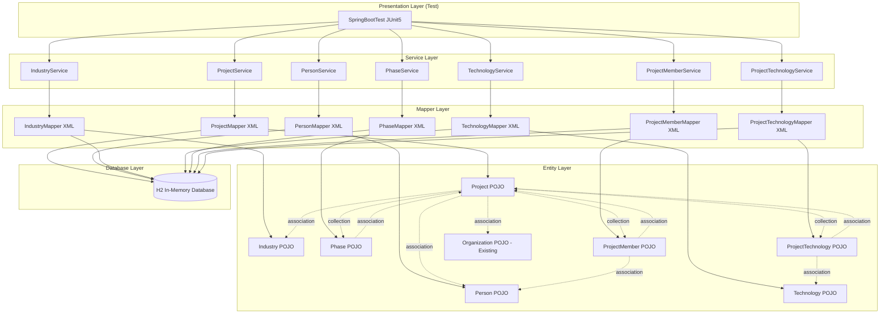
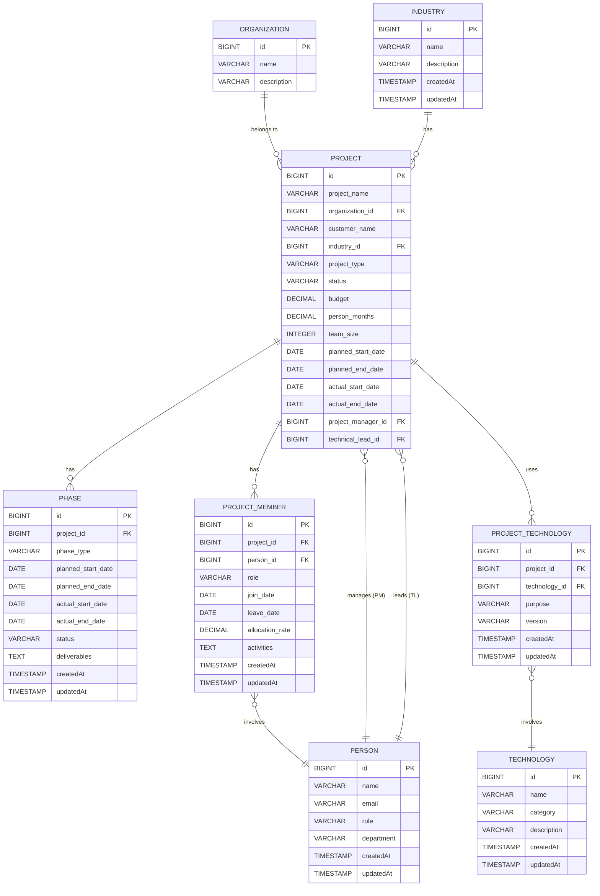

# Technical Design Document

## Overview

本機能は、既存のSpring Boot + MyBatisプロジェクト管理システムを拡張し、実際のITプロジェクト実績を包括的に管理する機能を追加する。Person（人物）、Industry（業界）、Technology（技術）、Phase（工程）、ProjectMember（プロジェクトメンバー）、ProjectTechnology（プロジェクト技術）の6つの新規エンティティと、Projectエンティティの大幅な拡張により、プロジェクトメンバーの参画履歴、技術スタック、工程計画・実績、顧客業界、プロジェクト規模、責任者を一元管理する。

**Purpose**: ITプロジェクトの実績データ（メンバー参画、技術使用、工程進捗、顧客情報、規模・期間）を体系的に記録・管理し、MyBatisの高度なマッピングパターン（association、collection、多対多、Enum型、LocalDate型）を実践的に学習できる環境を提供する。

**Users**: MyBatis学習者が、実務で頻出するリレーションシップパターンとデータ型マッピングを段階的に習得できる。

**Impact**: 既存のOrganization/Projectエンティティを維持しつつ、Projectエンティティに多数のフィールドと関連エンティティを追加する。既存のbasic-crud実装との互換性を保ちながら、高度なマッピング機能を段階的に学習できる構成に拡張する。

### Goals

- 6つの新規エンティティ（Person、Industry、Technology、Phase、ProjectMember、ProjectTechnology）のCRUD機能実装
- Projectエンティティに顧客情報、規模、期間、責任者フィールドを追加
- MyBatisのassociationマッピング（多対一）を複数箇所で実装（Project→Industry、Project→Person、ProjectMember→Person/Project、ProjectTechnology→Technology/Project、Phase→Project）
- MyBatisのcollectionマッピング（一対多）を実装（Project→List<Phase>、Project→List<ProjectMember>、Project→List<ProjectTechnology>）
- 多対多関係（Project↔Person、Project↔Technology）を中間テーブル経由で実装
- Enum型マッピング（ProjectType、ProjectStatus、MemberRole、PhaseType、TechnologyCategory）の実装
- Java 8 LocalDate型マッピング（計画・実績日付）の実装
- 複雑なクエリと集計機能（プロジェクトごとの人月集計、技術別プロジェクト数、業界別分析）の実装
- データ整合性と検証機能（値範囲チェック、外部キー制約、必須フィールド）の実装
- System.out.printlnによる詳細なデータ出力とSQL実行ログ

### Non-Goals

- フロントエンドUI開発（本機能はバックエンドとデータ層のみ）
- REST API公開（学習用途のためServiceレイヤーまで）
- 本番環境デプロイ（H2インメモリデータベースで完結）
- トランザクション分離レベルの高度な制御（Spring標準@Transactionalを使用）
- パフォーマンス最適化（キャッシング、ページング等は将来スコープ）
- 監査ログ機能（createdAt、updatedAtのみ）

## Architecture

### Existing Architecture Analysis

**現在のアーキテクチャ**:
- **レイヤー構成**: Entity（POJO） → Mapper Interface + XML → Service → Test
- **既存エンティティ**: Organization、Project
- **既存リレーション**: Project → Organization（多対一、associationマッピング）
- **データベース**: H2インメモリDB、AUTO_INCREMENT主キー、外部キー制約
- **トランザクション管理**: Spring @Transactional
- **テスト戦略**: SpringBootTest + JUnit5、System.out.printlnによるデータ確認

**統合制約**:
- 既存Projectエンティティの構造（id、projectName、organizationId）を維持
- 既存OrganizationMapper、ProjectMapper、OrganizationService、ProjectServiceとの互換性保持
- 既存テスト（MyBatisApplicationTests、DatabaseSchemaTest）が引き続きパスすること
- 既存schema.sqlに新規テーブル定義を追加

### Architecture Pattern & Boundary Map

**選択パターン**: Layered Architecture（レイヤードアーキテクチャ）
- **理由**: 学習プロジェクトとして、各レイヤーの責務を明確に分離し、MyBatisの機能を段階的に理解できる構成

**ドメイン境界**:
- **Core Domain**: Project、Person、Organization、Industry、Technology（マスタデータ＋プロジェクト情報）
- **Supporting Domain**: Phase（工程管理）、ProjectMember（メンバー参画履歴）、ProjectTechnology（技術スタック管理）

**既存パターン維持**:
- POJO + XML Mapper + resultMap
- Service層での@Transactional
- H2 AUTO_INCREMENT主キー

**新規コンポーネント追加理由**:
- **Person**: プロジェクトの責任者とメンバーを統一管理
- **Industry**: 顧客業界の分類とプロジェクト分析
- **Technology**: 技術スタックの体系的管理と分析
- **Phase**: プロジェクト工程の計画・実績管理
- **ProjectMember**: メンバー参画履歴（役割、期間、稼働率）の詳細記録
- **ProjectTechnology**: プロジェクトで使用した技術（バージョン、用途）の記録

**Steering準拠**:
- `tech.md`: MyBatis 3.5.16、H2 Database、Maven、Java 21を継続使用
- `structure.md`: src/main/java/、src/main/resources/mappers/、src/test/java/の構造を維持
- `product.md`: 学習プロジェクトとして段階的な機能追加を重視



### Technology Stack

| Layer | Choice / Version | Role in Feature | Notes |
|-------|------------------|-----------------|-------|
| Language | Java 21 | POJOエンティティ、Mapper、Service実装 | 既存環境を継続使用 |
| Build Tool | Maven 3.x | 依存関係管理、ビルド、テスト実行 | 既存環境を継続使用 |
| ORM/SQL Mapper | MyBatis 3.5.16 | SQL実行、resultMap/association/collectionマッピング | LocalDate/Enum型のネイティブサポート確認済み |
| Database | H2 Database 2.2.224 (In-Memory) | データ永続化、外部キー制約、AUTO_INCREMENT | 学習用途に最適 |
| DI/Transaction | Spring Boot 3.x | @Transactional、依存性注入 | 既存環境を継続使用 |
| Testing | JUnit 5 + SpringBootTest | 統合テスト、TDD実装 | 既存パターンを継続 |

**技術選定の根拠**:
- **MyBatis 3.5.16**: 3.4.5以降でJSR-310（LocalDate/LocalDateTime）をネイティブサポート。Enum型も標準TypeHandlerで対応可能。`research.md`参照。
- **H2 In-Memory**: 外部DB不要で学習に集中でき、テスト実行が高速。
- **Spring Boot**: @Transactionalによる宣言的トランザクション管理でビジネスロジックに集中。

## Requirements Traceability

| Requirement | Summary | Components | Key Interfaces | Data Models |
|-------------|---------|------------|----------------|-------------|
| 1 | Personエンティティ管理 | Person POJO, PersonMapper, PersonService | PersonMapper.insert/selectById/selectAll/findByEmail | persons table |
| 2 | Industry業界マスタ管理 | Industry POJO, IndustryMapper, IndustryService | IndustryMapper.insert/selectById/findByName | industries table |
| 3 | Technology技術マスタ管理 | Technology POJO, TechnologyMapper, TechnologyService | TechnologyMapper.insert/selectById/findByCategory | technologies table, TechnologyCategory enum |
| 4 | Projectエンティティ拡張（顧客・特性） | Project POJO拡張, ProjectMapper拡張 | Project.customerName/industry/projectType/status | projects table拡張, ProjectType/ProjectStatus enum |
| 5 | Projectエンティティ拡張（規模・期間） | Project POJO拡張, ProjectMapper拡張 | Project.budget/personMonths/teamSize/plannedStartDate/actualEndDate | projects table拡張 |
| 6 | Projectエンティティ拡張（責任者） | Project POJO拡張, ProjectMapper拡張 | Project.projectManager/technicalLead association | projects table拡張 (FKs to persons) |
| 7 | ProjectMemberメンバー参画履歴管理 | ProjectMember POJO, ProjectMemberMapper, ProjectMemberService | ProjectMemberMapper.insert/findByProjectId/findByPersonId | project_members table, MemberRole enum |
| 8 | ProjectTechnology技術スタック管理 | ProjectTechnology POJO, ProjectTechnologyMapper, ProjectTechnologyService | ProjectTechnologyMapper.insert/findByProjectId/findByTechnologyId | project_technologies table |
| 9 | Phase工程計画・実績管理 | Phase POJO, PhaseMapper, PhaseService | PhaseMapper.insert/findByProjectId | phases table, PhaseType/PhaseStatus enum |
| 10 | リレーションシップマッピング | ProjectMapper resultMap拡張 | association/collection in ProjectMapper XML | JOINクエリ、resultMap定義 |
| 11 | 削除時の関連データ処理 | ProjectMapper.delete, Schema ON CASCADE | ProjectMapper.deleteById with cascading deletes | Foreign key constraints with ON DELETE CASCADE |
| 12 | 複雑なクエリと集計機能 | ProjectService/TechnologyService/IndustryService | findByStatus/findByIndustryId/aggregateByTechnology | GROUP BY/JOIN queries |
| 13 | データ出力とログ機能 | All Entity toString(), MyBatis logging config | toString() in all POJOs, mybatis.configuration.log-impl | MyBatis logging to stdout |
| 14 | データ整合性と検証 | Service validation logic, DB constraints | Service layer validation methods | NOT NULL constraints, CHECK constraints |

## Components and Interfaces

### Component Summary

| Component | Domain/Layer | Intent | Req Coverage | Key Dependencies | Contracts |
|-----------|--------------|--------|--------------|------------------|-----------|
| Person | Entity | PM・リード・メンバーを表現 | 1 | なし | POJO |
| Industry | Entity | 顧客業界マスタ | 2 | なし | POJO |
| Technology | Entity | 技術マスタ | 3 | なし | POJO |
| Phase | Entity | 工程計画・実績 | 9 | Project (FK) | POJO |
| ProjectMember | Entity | メンバー参画履歴 | 7 | Project, Person (FKs) | POJO |
| ProjectTechnology | Entity | プロジェクト技術スタック | 8 | Project, Technology (FKs) | POJO |
| Project（拡張） | Entity | プロジェクト実績（拡張） | 4, 5, 6, 10 | Organization, Industry, Person (FKs) | POJO |
| PersonMapper | Mapper | PersonのCRUD操作 | 1 | MyBatis (P0) | Service |
| IndustryMapper | Mapper | IndustryのCRUD操作 | 2 | MyBatis (P0) | Service |
| TechnologyMapper | Mapper | TechnologyのCRUD操作 | 3 | MyBatis (P0) | Service |
| PhaseMapper | Mapper | PhaseのCRUD操作 | 9 | MyBatis (P0) | Service |
| ProjectMemberMapper | Mapper | ProjectMemberのCRUD操作 | 7 | MyBatis (P0) | Service |
| ProjectTechnologyMapper | Mapper | ProjectTechnologyのCRUD操作 | 8 | MyBatis (P0) | Service |
| ProjectMapper（拡張） | Mapper | Project拡張CRUD、複雑クエリ | 4, 5, 6, 10, 12 | MyBatis (P0) | Service |
| PersonService | Service | Personビジネスロジック | 1 | PersonMapper (P0) | Service |
| IndustryService | Service | Industry集計・分析 | 2, 12 | IndustryMapper (P0) | Service |
| TechnologyService | Service | Technology集計・分析 | 3, 12 | TechnologyMapper (P0) | Service |
| PhaseService | Service | Phase管理 | 9 | PhaseMapper (P0) | Service |
| ProjectMemberService | Service | ProjectMember管理・集計 | 7, 12 | ProjectMemberMapper (P0) | Service |
| ProjectTechnologyService | Service | ProjectTechnology管理 | 8 | ProjectTechnologyMapper (P0) | Service |
| ProjectService（拡張） | Service | Project拡張ビジネスロジック | 4, 5, 6, 11, 12, 14 | ProjectMapper (P0) | Service |

### Entity Layer

#### Person

| Field | Detail |
|-------|--------|
| Intent | PM、技術リード、メンバーを表現するPOJO |
| Requirements | 1 |

**Responsibilities & Constraints**
- プロジェクトの責任者とメンバーを統一管理
- email uniqueness（業務上の一意性、DB制約は任意）
- name、email、role、departmentを必須項目として保持

**Dependencies**
- Outbound: なし（マスタデータ）
- Inbound: ProjectMember（多対多中間）、Project（projectManager/technicalLead）

**Contracts**: State [x]

##### State Model

```java
public class Person {
    private Long id;                  // 主キー（AUTO_INCREMENT）
    private String name;              // 名前（必須）
    private String email;             // メールアドレス（必須）
    private String role;              // 役職（例: シニアエンジニア、PM）
    private String department;        // 所属部署（必須）
    private LocalDateTime createdAt;  // 作成日時
    private LocalDateTime updatedAt;  // 更新日時

    // Getters, Setters, toString()
}
```

**Implementation Notes**
- Integration: PersonMapperでCRUD、PersonServiceでビジネスロジック
- Validation: email形式チェック（Service層）、name/email/department非NULL（DB制約）
- Risks: なし（シンプルなマスタデータ）

#### Industry

| Field | Detail |
|-------|--------|
| Intent | 顧客業界マスタ（金融、製造、小売、通信等） |
| Requirements | 2 |

**Responsibilities & Constraints**
- 業界分類の一元管理
- name uniqueness推奨
- 複数Projectから参照される

**Dependencies**
- Outbound: なし（マスタデータ）
- Inbound: Project（industry FK）

**Contracts**: State [x]

##### State Model

```java
public class Industry {
    private Long id;                  // 主キー（AUTO_INCREMENT）
    private String name;              // 業界名（必須、例: 金融、製造、小売）
    private String description;       // 業界説明
    private LocalDateTime createdAt;  // 作成日時
    private LocalDateTime updatedAt;  // 更新日時

    // Getters, Setters, toString()
}
```

**Implementation Notes**
- Integration: IndustryMapperでCRUD、IndustryServiceで業界別集計
- Validation: name非NULL（DB制約）
- Risks: なし（シンプルなマスタデータ）

#### Technology

| Field | Detail |
|-------|--------|
| Intent | 技術マスタ（Java、React、AWS等） |
| Requirements | 3 |

**Responsibilities & Constraints**
- 技術スタックの体系的管理
- TechnologyCategoryでカテゴリ分類（LANGUAGE、FRAMEWORK、DATABASE、INFRASTRUCTURE、TOOL、OTHER）
- 複数ProjectTechnologyから参照される

**Dependencies**
- Outbound: なし（マスタデータ）
- Inbound: ProjectTechnology（technology FK）

**Contracts**: State [x]

##### State Model

```java
public enum TechnologyCategory {
    LANGUAGE,          // プログラミング言語
    FRAMEWORK,         // フレームワーク
    DATABASE,          // データベース
    INFRASTRUCTURE,    // インフラ
    TOOL,              // ツール
    OTHER              // その他
}

public class Technology {
    private Long id;                      // 主キー（AUTO_INCREMENT）
    private String name;                  // 技術名（必須、例: Java、React、AWS）
    private TechnologyCategory category;  // カテゴリ（Enum、必須）
    private String description;           // 技術説明
    private LocalDateTime createdAt;      // 作成日時
    private LocalDateTime updatedAt;      // 更新日時

    // Getters, Setters, toString()
}
```

**Implementation Notes**
- Integration: TechnologyMapperでCRUD、TechnologyServiceで技術別集計
- Validation: name/category非NULL（DB制約）
- Risks: Enum型のデフォルトTypeHandler（EnumTypeHandler）により文字列として保存される点を`research.md`で確認済み

#### Phase

| Field | Detail |
|-------|--------|
| Intent | プロジェクト工程の計画・実績管理 |
| Requirements | 9 |

**Responsibilities & Constraints**
- 主要工程（要件定義、設計、実装、テスト、リリース）の計画と実績を記録
- PhaseType（REQUIREMENTS、DESIGN、IMPLEMENTATION、TESTING、RELEASE）でフェーズを分類
- PhaseStatus（NOT_STARTED、IN_PROGRESS、COMPLETED）で進行状況を管理
- 1つのProjectに複数のPhaseが紐づく（一対多）

**Dependencies**
- Outbound: Project（projectId FK、associationマッピング）
- Inbound: なし

**Contracts**: State [x]

##### State Model

```java
public enum PhaseType {
    REQUIREMENTS,       // 要件定義
    DESIGN,             // 設計
    IMPLEMENTATION,     // 実装
    TESTING,            // テスト
    RELEASE             // リリース
}

public enum PhaseStatus {
    NOT_STARTED,    // 未着手
    IN_PROGRESS,    // 進行中
    COMPLETED       // 完了
}

public class Phase {
    private Long id;                    // 主キー（AUTO_INCREMENT）
    private Long projectId;             // プロジェクトID（FK、必須）
    private PhaseType phaseType;        // 工程種別（Enum、必須）
    private LocalDate plannedStartDate; // 計画開始日（必須）
    private LocalDate plannedEndDate;   // 計画終了日（必須）
    private LocalDate actualStartDate;  // 実績開始日
    private LocalDate actualEndDate;    // 実績終了日
    private PhaseStatus status;         // ステータス（Enum、デフォルトNOT_STARTED）
    private String deliverables;        // 成果物情報
    private LocalDateTime createdAt;    // 作成日時
    private LocalDateTime updatedAt;    // 更新日時

    // Association
    private Project project;            // MyBatis associationマッピング用

    // Getters, Setters, toString()
}
```

**Implementation Notes**
- Integration: PhaseMapperでCRUD、PhaseServiceで工程管理ロジック
- Validation: projectId/phaseType/plannedStartDate/plannedEndDate非NULL（DB制約）
- Risks: actualEndDate < plannedEndDateの検証は警告ログのみ（Requirement 14.3）

#### ProjectMember

| Field | Detail |
|-------|--------|
| Intent | プロジェクトメンバーの参画履歴（役割、期間、稼働率） |
| Requirements | 7 |

**Responsibilities & Constraints**
- Project ↔ Personの多対多中間テーブル
- MemberRole（PROJECT_MANAGER、TECHNICAL_LEAD、DEVELOPER、TESTER、DESIGNER、ADVISOR、OTHER）で役割を分類
- allocationRateは0.0～1.0（0%～100%）の範囲で管理
- joinDate必須、leaveDateは参画終了時に設定

**Dependencies**
- Outbound: Project（projectId FK、associationマッピング）、Person（personId FK、associationマッピング）
- Inbound: なし

**Contracts**: State [x]

##### State Model

```java
public enum MemberRole {
    PROJECT_MANAGER,    // プロジェクトマネージャー
    TECHNICAL_LEAD,     // 技術リード
    DEVELOPER,          // 開発者
    TESTER,             // テスター
    DESIGNER,           // デザイナー
    ADVISOR,            // アドバイザー
    OTHER               // その他
}

public class ProjectMember {
    private Long id;                    // 主キー（AUTO_INCREMENT）
    private Long projectId;             // プロジェクトID（FK、必須）
    private Long personId;              // PersonID（FK、必須）
    private MemberRole role;            // 役割（Enum、必須）
    private LocalDate joinDate;         // 参画開始日（必須）
    private LocalDate leaveDate;        // 参画終了日
    private BigDecimal allocationRate;  // 稼働率（0.0～1.0、必須）
    private String activities;          // 活動内容
    private LocalDateTime createdAt;    // 作成日時
    private LocalDateTime updatedAt;    // 更新日時

    // Associations
    private Project project;            // MyBatis associationマッピング用
    private Person person;              // MyBatis associationマッピング用

    // Getters, Setters, toString()
}
```

**Implementation Notes**
- Integration: ProjectMemberMapperでCRUD、ProjectMemberServiceで人月集計
- Validation: allocationRate範囲チェック（0.0～1.0）、leaveDate >= joinDateチェック（Service層）
- Risks: 人月集計ロジックで参画期間とallocationRateから正確な計算を行う必要がある

#### ProjectTechnology

| Field | Detail |
|-------|--------|
| Intent | プロジェクトで使用した技術スタック（バージョン、用途） |
| Requirements | 8 |

**Responsibilities & Constraints**
- Project ↔ Technologyの多対多中間テーブル
- version（Java 17、React 18等）とpurpose（用途）を記録
- 1つのプロジェクトで同一技術を異なる用途で複数回使用可能

**Dependencies**
- Outbound: Project（projectId FK、associationマッピング）、Technology（technologyId FK、associationマッピング）
- Inbound: なし

**Contracts**: State [x]

##### State Model

```java
public class ProjectTechnology {
    private Long id;                    // 主キー（AUTO_INCREMENT）
    private Long projectId;             // プロジェクトID（FK、必須）
    private Long technologyId;          // TechnologyID（FK、必須）
    private String purpose;             // 用途（必須、例: バックエンドAPI、フロントエンドUI）
    private String version;             // バージョン（例: Java 17、React 18）
    private LocalDateTime createdAt;    // 作成日時
    private LocalDateTime updatedAt;    // 更新日時

    // Associations
    private Project project;            // MyBatis associationマッピング用
    private Technology technology;      // MyBatis associationマッピング用

    // Getters, Setters, toString()
}
```

**Implementation Notes**
- Integration: ProjectTechnologyMapperでCRUD、ProjectTechnologyServiceで技術スタック管理
- Validation: projectId/technologyId/purpose非NULL（DB制約）
- Risks: なし（シンプルな多対多中間テーブル）

#### Project（拡張）

| Field | Detail |
|-------|--------|
| Intent | プロジェクト実績管理（既存フィールド＋顧客・規模・期間・責任者） |
| Requirements | 4, 5, 6, 10 |

**Responsibilities & Constraints**
- 既存フィールド（id、projectName、organizationId）を維持
- 顧客情報（customerName、industry）を追加
- プロジェクト特性（projectType、status）を追加（Enum型）
- 規模（budget、personMonths、teamSize）を追加
- 期間（計画：plannedStartDate/plannedEndDate、実績：actualStartDate/actualEndDate）を追加（LocalDate型）
- 責任者（projectManager、technicalLead）を追加（Person FK、associationマッピング）
- 関連コレクション（phases、projectMembers、projectTechnologies）を追加（collectionマッピング）

**Dependencies**
- Outbound: Organization（organizationId FK、既存）、Industry（industryId FK、associationマッピング）、Person（projectManagerId/technicalLeadId FK、associationマッピング）
- Inbound: Phase（collectionマッピング）、ProjectMember（collectionマッピング）、ProjectTechnology（collectionマッピング）

**Contracts**: State [x]

##### State Model

```java
public enum ProjectType {
    NEW_DEVELOPMENT,     // 新規開発
    MAINTENANCE,         // 保守
    CONSULTING,          // コンサルティング
    PACKAGE,             // パッケージ導入
    IN_HOUSE_SERVICE     // 自社サービス
}

public enum ProjectStatus {
    PLANNING,       // 計画中
    IN_PROGRESS,    // 進行中
    COMPLETED,      // 完了
    CANCELLED       // 中止
}

public class Project {
    // 既存フィールド
    private Long id;
    private String projectName;
    private Long organizationId;
    private Organization organization;  // 既存association

    // 新規フィールド（顧客情報）
    private String customerName;        // 顧客名（必須）
    private Long industryId;            // 業界ID（FK）
    private Industry industry;          // Industry associationマッピング用

    // 新規フィールド（プロジェクト特性）
    private ProjectType projectType;    // プロジェクト種別（Enum、必須）
    private ProjectStatus status;       // ステータス（Enum、必須）

    // 新規フィールド（規模）
    private BigDecimal budget;          // 予算金額
    private BigDecimal personMonths;    // 人月
    private Integer teamSize;           // チームサイズ

    // 新規フィールド（期間）
    private LocalDate plannedStartDate;  // 計画開始日（必須）
    private LocalDate plannedEndDate;    // 計画終了日（必須）
    private LocalDate actualStartDate;   // 実績開始日
    private LocalDate actualEndDate;     // 実績終了日

    // 新規フィールド（責任者）
    private Long projectManagerId;       // PM ID（FK、必須）
    private Person projectManager;       // PM associationマッピング用
    private Long technicalLeadId;        // 技術リードID（FK）
    private Person technicalLead;        // 技術リード associationマッピング用

    // 新規コレクション
    private List<Phase> phases;                           // Phase collectionマッピング用
    private List<ProjectMember> projectMembers;           // ProjectMember collectionマッピング用
    private List<ProjectTechnology> projectTechnologies;  // ProjectTechnology collectionマッピング用

    // Getters, Setters, toString()（既存含めすべて）
}
```

**Implementation Notes**
- Integration: 既存ProjectMapperを拡張し、新規フィールド用のINSERT/UPDATE/SELECTメソッドを追加。association/collectionマッピングを含む複雑なresultMapを定義。
- Validation: customerName/projectType/status/plannedStartDate/plannedEndDate/projectManagerId非NULL（DB制約）、budget >= 0チェック（Service層）
- Risks: 既存テストとの互換性確保のため、新規フィールドはすべてnullableまたはデフォルト値を持つ。既存MyBatisApplicationTests、DatabaseSchemaTestが引き続きパスすることを確認。

### Mapper Layer

#### PersonMapper

| Field | Detail |
|-------|--------|
| Intent | PersonのCRUD操作をMyBatis XMLマッパーで提供 |
| Requirements | 1 |

**Responsibilities & Constraints**
- CRUD操作（insert、selectById、selectAll、update、deleteById）
- findByEmailメソッドでemailアドレス検索

**Dependencies**
- Inbound: PersonService（P0）
- External: MyBatis 3.5.16（P0）

**Contracts**: Service [x]

##### Service Interface

```java
@Mapper
public interface PersonMapper {
    void insert(Person person);
    Person selectById(Long id);
    List<Person> selectAll();
    Person findByEmail(String email);
    void update(Person person);
    void deleteById(Long id);
}
```

**Preconditions**:
- insert: person.name/email/role/department非NULL
- selectById/findByEmail: idまたはemailが有効な値

**Postconditions**:
- insert: person.idに自動採番されたIDが設定される
- selectById/findByEmail: 該当レコードがない場合null

**Invariants**: emailは業務上一意性が推奨されるが、DB制約は任意

**Implementation Notes**
- Integration: PersonMapper.xmlでresultMap、INSERT/SELECT/UPDATE/DELETE文を定義。useGeneratedKeys="true"でID自動採番。
- Validation: Service層でemail形式チェック、DB制約でNOT NULLチェック
- Risks: なし（標準的なCRUD Mapper）

#### IndustryMapper

| Field | Detail |
|-------|--------|
| Intent | IndustryのCRUD操作をMyBatis XMLマッパーで提供 |
| Requirements | 2 |

**Responsibilities & Constraints**
- CRUD操作（insert、selectById、selectAll、update、deleteById）
- findByNameメソッドで業界名検索

**Dependencies**
- Inbound: IndustryService（P0）
- External: MyBatis 3.5.16（P0）

**Contracts**: Service [x]

##### Service Interface

```java
@Mapper
public interface IndustryMapper {
    void insert(Industry industry);
    Industry selectById(Long id);
    List<Industry> selectAll();
    Industry findByName(String name);
    void update(Industry industry);
    void deleteById(Long id);
}
```

**Preconditions**:
- insert: industry.name非NULL
- selectById/findByName: idまたはnameが有効な値

**Postconditions**:
- insert: industry.idに自動採番されたIDが設定される
- selectById/findByName: 該当レコードがない場合null

**Invariants**: nameは業務上一意性が推奨

**Implementation Notes**
- Integration: IndustryMapper.xmlでresultMap、INSERT/SELECT/UPDATE/DELETE文を定義
- Validation: DB制約でname非NULLチェック
- Risks: なし（標準的なCRUD Mapper）

#### TechnologyMapper

| Field | Detail |
|-------|--------|
| Intent | TechnologyのCRUD操作をMyBatis XMLマッパーで提供 |
| Requirements | 3 |

**Responsibilities & Constraints**
- CRUD操作（insert、selectById、selectAll、update、deleteById）
- findByCategoryメソッドでカテゴリ検索

**Dependencies**
- Inbound: TechnologyService（P0）
- External: MyBatis 3.5.16（P0）

**Contracts**: Service [x]

##### Service Interface

```java
@Mapper
public interface TechnologyMapper {
    void insert(Technology technology);
    Technology selectById(Long id);
    List<Technology> selectAll();
    List<Technology> findByCategory(TechnologyCategory category);
    void update(Technology technology);
    void deleteById(Long id);
}
```

**Preconditions**:
- insert: technology.name/category非NULL
- findByCategory: categoryがTechnologyCategoryのいずれか

**Postconditions**:
- insert: technology.idに自動採番されたIDが設定される
- findByCategory: 該当するカテゴリのすべてのTechnologyをリストで返す

**Invariants**: categoryはEnum型（EnumTypeHandlerでVARCHARに保存）

**Implementation Notes**
- Integration: TechnologyMapper.xmlでresultMap、INSERT/SELECT/UPDATE/DELETE文を定義。Enum型は自動的に文字列として保存される。
- Validation: DB制約でname/category非NULLチェック
- Risks: Enum型のEnumTypeHandler動作を`research.md`で確認済み

#### PhaseMapper

| Field | Detail |
|-------|--------|
| Intent | PhaseのCRUD操作をMyBatis XMLマッパーで提供 |
| Requirements | 9 |

**Responsibilities & Constraints**
- CRUD操作（insert、selectById、selectAll、update、deleteById）
- findByProjectIdメソッドでプロジェクトに紐づくすべてのPhaseを取得
- associationマッピングでProject情報を含むresultMapを提供

**Dependencies**
- Inbound: PhaseService（P0）
- Outbound: Project（associationマッピング、P1）
- External: MyBatis 3.5.16（P0）

**Contracts**: Service [x]

##### Service Interface

```java
@Mapper
public interface PhaseMapper {
    void insert(Phase phase);
    Phase selectById(Long id);
    List<Phase> selectAll();
    List<Phase> findByProjectId(Long projectId);
    void update(Phase phase);
    void deleteById(Long id);
}
```

**Preconditions**:
- insert: phase.projectId/phaseType/plannedStartDate/plannedEndDate非NULL
- findByProjectId: projectIdが有効な値

**Postconditions**:
- insert: phase.idに自動採番されたIDが設定される
- findByProjectId: 該当するすべてのPhaseをリストで返す

**Invariants**: phaseType、statusはEnum型（EnumTypeHandlerでVARCHARに保存）

**Implementation Notes**
- Integration: PhaseMapper.xmlでresultMap（associationを含む）、INSERT/SELECT/UPDATE/DELETE文を定義。LocalDate型はMyBatis標準TypeHandlerでDATEカラムにマッピング。
- Validation: DB制約でprojectId/phaseType/plannedStartDate/plannedEndDate非NULLチェック、外部キー制約でprojectId参照整合性
- Risks: なし（標準的なCRUD Mapper + association）

#### ProjectMemberMapper

| Field | Detail |
|-------|--------|
| Intent | ProjectMemberのCRUD操作をMyBatis XMLマッパーで提供 |
| Requirements | 7 |

**Responsibilities & Constraints**
- CRUD操作（insert、selectById、selectAll、update、deleteById）
- findByProjectIdメソッドでプロジェクトに参画しているすべてのメンバーを取得
- findByPersonIdメソッドでPersonが参画したすべてのプロジェクトメンバー情報を取得
- associationマッピングでProject/Person情報を含むresultMapを提供

**Dependencies**
- Inbound: ProjectMemberService（P0）
- Outbound: Project、Person（associationマッピング、P1）
- External: MyBatis 3.5.16（P0）

**Contracts**: Service [x]

##### Service Interface

```java
@Mapper
public interface ProjectMemberMapper {
    void insert(ProjectMember projectMember);
    ProjectMember selectById(Long id);
    List<ProjectMember> selectAll();
    List<ProjectMember> findByProjectId(Long projectId);
    List<ProjectMember> findByPersonId(Long personId);
    void update(ProjectMember projectMember);
    void deleteById(Long id);
}
```

**Preconditions**:
- insert: projectMember.projectId/personId/role/joinDate/allocationRate非NULL
- findByProjectId/findByPersonId: projectIdまたはpersonIdが有効な値

**Postconditions**:
- insert: projectMember.idに自動採番されたIDが設定される
- findByProjectId/findByPersonId: 該当するすべてのProjectMemberをリストで返す

**Invariants**: roleはEnum型、allocationRateは0.0～1.0の範囲

**Implementation Notes**
- Integration: ProjectMemberMapper.xmlでresultMap（ProjectとPersonへのassociationを含む）、INSERT/SELECT/UPDATE/DELETE文を定義。
- Validation: DB制約でprojectId/personId/role/joinDate/allocationRate非NULLチェック、Service層でallocationRate範囲チェック（0.0～1.0）、leaveDate >= joinDateチェック
- Risks: 多対多中間テーブルのため、associationマッピングでProjectとPersonの両方を取得する複雑なresultMapが必要

#### ProjectTechnologyMapper

| Field | Detail |
|-------|--------|
| Intent | ProjectTechnologyのCRUD操作をMyBatis XMLマッパーで提供 |
| Requirements | 8 |

**Responsibilities & Constraints**
- CRUD操作（insert、selectById、selectAll、update、deleteById）
- findByProjectIdメソッドでプロジェクトで使用されているすべての技術を取得
- findByTechnologyIdメソッドで指定された技術が使用されているすべてのプロジェクトを取得
- associationマッピングでProject/Technology情報を含むresultMapを提供

**Dependencies**
- Inbound: ProjectTechnologyService（P0）
- Outbound: Project、Technology（associationマッピング、P1）
- External: MyBatis 3.5.16（P0）

**Contracts**: Service [x]

##### Service Interface

```java
@Mapper
public interface ProjectTechnologyMapper {
    void insert(ProjectTechnology projectTechnology);
    ProjectTechnology selectById(Long id);
    List<ProjectTechnology> selectAll();
    List<ProjectTechnology> findByProjectId(Long projectId);
    List<ProjectTechnology> findByTechnologyId(Long technologyId);
    void update(ProjectTechnology projectTechnology);
    void deleteById(Long id);
}
```

**Preconditions**:
- insert: projectTechnology.projectId/technologyId/purpose非NULL
- findByProjectId/findByTechnologyId: projectIdまたはtechnologyIdが有効な値

**Postconditions**:
- insert: projectTechnology.idに自動採番されたIDが設定される
- findByProjectId/findByTechnologyId: 該当するすべてのProjectTechnologyをリストで返す

**Invariants**: なし

**Implementation Notes**
- Integration: ProjectTechnologyMapper.xmlでresultMap（ProjectとTechnologyへのassociationを含む）、INSERT/SELECT/UPDATE/DELETE文を定義。
- Validation: DB制約でprojectId/technologyId/purpose非NULLチェック
- Risks: 多対多中間テーブルのため、associationマッピングでProjectとTechnologyの両方を取得する複雑なresultMapが必要

#### ProjectMapper（拡張）

| Field | Detail |
|-------|--------|
| Intent | Project拡張CRUD操作と複雑なクエリをMyBatis XMLマッパーで提供 |
| Requirements | 4, 5, 6, 10, 11, 12 |

**Responsibilities & Constraints**
- 既存CRUD操作を拡張（insert、selectById、selectAll、update、deleteById）
- 新規フィールド（顧客情報、規模、期間、責任者）を含むINSERT/UPDATE/SELECT
- associationマッピングでIndustry、projectManager（Person）、technicalLead（Person）を取得
- collectionマッピングでPhase、ProjectMember、ProjectTechnologyを取得
- 複雑なクエリ（findByStatus、findByIndustryId、findByProjectType、findByProjectManagerId、findByTechnicalLeadId）
- 削除時の関連データカスケード削除（ON DELETE CASCADEまたは明示的DELETE文）

**Dependencies**
- Inbound: ProjectService（P0）
- Outbound: Organization、Industry、Person（associationマッピング、P1）、Phase/ProjectMember/ProjectTechnology（collectionマッピング、P1）
- External: MyBatis 3.5.16（P0）

**Contracts**: Service [x]

##### Service Interface

```java
@Mapper
public interface ProjectMapper {
    // 既存メソッド
    void insert(Project project);
    Project selectById(Long id);
    List<Project> selectAll();
    List<Project> selectByOrganizationId(Long organizationId);
    Project selectProjectWithOrganization(Long id);
    void update(Project project);
    void deleteById(Long id);

    // 新規メソッド（複雑なクエリ）
    List<Project> findByStatus(ProjectStatus status);
    List<Project> findByIndustryId(Long industryId);
    List<Project> findByProjectType(ProjectType projectType);
    List<Project> findByProjectManagerId(Long projectManagerId);
    List<Project> findByTechnicalLeadId(Long technicalLeadId);

    // association/collection付きの取得
    Project selectProjectWithAllRelations(Long id);  // Industry、PM、TL、Phases、Members、Technologies含む
}
```

**Preconditions**:
- insert: project.projectName/customerName/projectType/status/plannedStartDate/plannedEndDate/projectManagerId非NULL
- selectById/findByXXX: idまたは検索条件が有効な値

**Postconditions**:
- insert: project.idに自動採番されたIDが設定される
- selectProjectWithAllRelations: JOINクエリですべての関連データを一度に取得し、N+1問題を回避

**Invariants**: projectType、statusはEnum型（EnumTypeHandlerでVARCHARに保存）、plannedStartDate/plannedEndDate等はLocalDate型（DATEカラムにマッピング）

**Implementation Notes**
- Integration: ProjectMapper.xmlで複雑なresultMapを定義。association（Industry、PM、TL）、collection（Phases、ProjectMembers、ProjectTechnologies）を含むマッピングを記述。JOIN文でN+1問題を回避。
- Validation: DB制約で必須フィールドチェック、Service層でbudget >= 0チェック
- Risks: 既存テストとの互換性確保のため、新規フィールドはnullable。既存MyBatisApplicationTests、DatabaseSchemaTestが引き続きパスすることを確認。

### Service Layer

#### PersonService

| Field | Detail |
|-------|--------|
| Intent | Personビジネスロジックとトランザクション管理 |
| Requirements | 1 |

**Responsibilities & Constraints**
- PersonMapperを使用したCRUD操作
- email形式検証
- @Transactionalによるトランザクション管理

**Dependencies**
- Outbound: PersonMapper（P0）

**Contracts**: Service [x]

##### Service Interface

```java
@Service
@Transactional
public class PersonService {
    @Transactional
    public void createPerson(Person person);

    @Transactional(readOnly = true)
    public Person findById(Long id);

    @Transactional(readOnly = true)
    public List<Person> findAll();

    @Transactional(readOnly = true)
    public Person findByEmail(String email);

    @Transactional
    public void updatePerson(Person person);

    @Transactional
    public void deletePerson(Long id);
}
```

**Implementation Notes**
- Integration: PersonMapperを注入し、CRUD操作を委譲。email形式チェックをcreatePersonで実施。
- Validation: email形式チェック（正規表現）
- Risks: なし（標準的なService層）

#### IndustryService

| Field | Detail |
|-------|--------|
| Intent | Industry管理と業界別集計 |
| Requirements | 2, 12 |

**Responsibilities & Constraints**
- IndustryMapperを使用したCRUD操作
- 業界別プロジェクト数集計（Requirement 12.3）

**Dependencies**
- Outbound: IndustryMapper（P0）、ProjectMapper（P1、集計用）

**Contracts**: Service [x]

##### Service Interface

```java
@Service
@Transactional
public class IndustryService {
    @Transactional
    public void createIndustry(Industry industry);

    @Transactional(readOnly = true)
    public Industry findById(Long id);

    @Transactional(readOnly = true)
    public List<Industry> findAll();

    @Transactional(readOnly = true)
    public Industry findByName(String name);

    @Transactional
    public void updateIndustry(Industry industry);

    @Transactional
    public void deleteIndustry(Long id);

    // 集計機能
    @Transactional(readOnly = true)
    public Map<Industry, Integer> aggregateProjectCountByIndustry();
}
```

**Implementation Notes**
- Integration: IndustryMapperでCRUD、ProjectMapper.findByIndustryIdで業界別プロジェクト集計
- Validation: name非NULLチェック（DB制約）
- Risks: なし

#### TechnologyService

| Field | Detail |
|-------|--------|
| Intent | Technology管理と技術別集計 |
| Requirements | 3, 12 |

**Responsibilities & Constraints**
- TechnologyMapperを使用したCRUD操作
- 技術別プロジェクト数集計（Requirement 12.2）

**Dependencies**
- Outbound: TechnologyMapper（P0）、ProjectTechnologyMapper（P1、集計用）

**Contracts**: Service [x]

##### Service Interface

```java
@Service
@Transactional
public class TechnologyService {
    @Transactional
    public void createTechnology(Technology technology);

    @Transactional(readOnly = true)
    public Technology findById(Long id);

    @Transactional(readOnly = true)
    public List<Technology> findAll();

    @Transactional(readOnly = true)
    public List<Technology> findByCategory(TechnologyCategory category);

    @Transactional
    public void updateTechnology(Technology technology);

    @Transactional
    public void deleteTechnology(Long id);

    // 集計機能
    @Transactional(readOnly = true)
    public Map<Technology, Integer> aggregateProjectCountByTechnology();
}
```

**Implementation Notes**
- Integration: TechnologyMapperでCRUD、ProjectTechnologyMapper.findByTechnologyIdで技術別プロジェクト集計
- Validation: name/category非NULLチェック（DB制約）
- Risks: なし

#### PhaseService

| Field | Detail |
|-------|--------|
| Intent | Phase管理と工程進捗管理 |
| Requirements | 9 |

**Responsibilities & Constraints**
- PhaseMapperを使用したCRUD操作
- actualEndDate < plannedEndDateの警告ログ出力（Requirement 14.3）

**Dependencies**
- Outbound: PhaseMapper（P0）

**Contracts**: Service [x]

##### Service Interface

```java
@Service
@Transactional
public class PhaseService {
    @Transactional
    public void createPhase(Phase phase);

    @Transactional(readOnly = true)
    public Phase findById(Long id);

    @Transactional(readOnly = true)
    public List<Phase> findAll();

    @Transactional(readOnly = true)
    public List<Phase> findByProjectId(Long projectId);

    @Transactional
    public void updatePhase(Phase phase);

    @Transactional
    public void deletePhase(Long id);
}
```

**Implementation Notes**
- Integration: PhaseMapperでCRUD、updatePhaseでactual期間と計画期間の比較を実施し、警告ログ出力
- Validation: projectId/phaseType/plannedStartDate/plannedEndDate非NULLチェック（DB制約）、actual期間と計画期間の比較（警告のみ）
- Risks: なし

#### ProjectMemberService

| Field | Detail |
|-------|--------|
| Intent | ProjectMember管理とプロジェクトごとの人月集計 |
| Requirements | 7, 12 |

**Responsibilities & Constraints**
- ProjectMemberMapperを使用したCRUD操作
- allocationRate範囲チェック（0.0～1.0）（Requirement 14.2）
- leaveDate >= joinDateチェック（Requirement 14.4）
- プロジェクトごとの総人月集計（Requirement 12.1）

**Dependencies**
- Outbound: ProjectMemberMapper（P0）

**Contracts**: Service [x]

##### Service Interface

```java
@Service
@Transactional
public class ProjectMemberService {
    @Transactional
    public void createProjectMember(ProjectMember projectMember);

    @Transactional(readOnly = true)
    public ProjectMember findById(Long id);

    @Transactional(readOnly = true)
    public List<ProjectMember> findAll();

    @Transactional(readOnly = true)
    public List<ProjectMember> findByProjectId(Long projectId);

    @Transactional(readOnly = true)
    public List<ProjectMember> findByPersonId(Long personId);

    @Transactional
    public void updateProjectMember(ProjectMember projectMember);

    @Transactional
    public void deleteProjectMember(Long id);

    // 集計機能
    @Transactional(readOnly = true)
    public BigDecimal calculateTotalPersonMonths(Long projectId);
}
```

**Implementation Notes**
- Integration: ProjectMemberMapperでCRUD、calculateTotalPersonMonthsでallocationRateと参画期間から総人月を計算
- Validation: allocationRate範囲チェック（0.0～1.0）、leaveDate >= joinDateチェック、projectId/personId/role/joinDate/allocationRate非NULLチェック（DB制約）
- Risks: 人月計算ロジック（参画期間×allocationRate）の正確性が重要

#### ProjectTechnologyService

| Field | Detail |
|-------|--------|
| Intent | ProjectTechnology管理 |
| Requirements | 8 |

**Responsibilities & Constraints**
- ProjectTechnologyMapperを使用したCRUD操作

**Dependencies**
- Outbound: ProjectTechnologyMapper（P0）

**Contracts**: Service [x]

##### Service Interface

```java
@Service
@Transactional
public class ProjectTechnologyService {
    @Transactional
    public void createProjectTechnology(ProjectTechnology projectTechnology);

    @Transactional(readOnly = true)
    public ProjectTechnology findById(Long id);

    @Transactional(readOnly = true)
    public List<ProjectTechnology> findAll();

    @Transactional(readOnly = true)
    public List<ProjectTechnology> findByProjectId(Long projectId);

    @Transactional(readOnly = true)
    public List<ProjectTechnology> findByTechnologyId(Long technologyId);

    @Transactional
    public void updateProjectTechnology(ProjectTechnology projectTechnology);

    @Transactional
    public void deleteProjectTechnology(Long id);
}
```

**Implementation Notes**
- Integration: ProjectTechnologyMapperでCRUD
- Validation: projectId/technologyId/purpose非NULLチェック（DB制約）
- Risks: なし

#### ProjectService（拡張）

| Field | Detail |
|-------|--------|
| Intent | Project拡張ビジネスロジック、削除時カスケード処理、データ整合性検証 |
| Requirements | 4, 5, 6, 11, 12, 14 |

**Responsibilities & Constraints**
- ProjectMapperを使用した拡張CRUD操作
- budget >= 0チェック（Requirement 14.1）
- 削除時に関連Phase/ProjectMember/ProjectTechnologyのカスケード削除（Requirement 11.1～11.3）
- 複雑なクエリ実行（findByStatus、findByIndustryId、findByProjectType）

**Dependencies**
- Outbound: ProjectMapper（P0）、PhaseMapper（P1、削除用）、ProjectMemberMapper（P1、削除用）、ProjectTechnologyMapper（P1、削除用）

**Contracts**: Service [x]

##### Service Interface

```java
@Service
@Transactional
public class ProjectService {
    // 既存メソッド（拡張）
    @Transactional
    public void createProject(Project project);

    @Transactional(readOnly = true)
    public Project findById(Long id);

    @Transactional(readOnly = true)
    public List<Project> findAll();

    @Transactional(readOnly = true)
    public List<Project> findByOrganizationId(Long organizationId);

    @Transactional(readOnly = true)
    public Project findProjectWithOrganization(Long id);

    @Transactional
    public void updateProject(Project project);

    @Transactional
    public void deleteProject(Long id);  // カスケード削除を含む

    // 新規メソッド（複雑なクエリ）
    @Transactional(readOnly = true)
    public List<Project> findByStatus(ProjectStatus status);

    @Transactional(readOnly = true)
    public List<Project> findByIndustryId(Long industryId);

    @Transactional(readOnly = true)
    public List<Project> findByProjectType(ProjectType projectType);

    @Transactional(readOnly = true)
    public List<Project> findByProjectManagerId(Long projectManagerId);

    @Transactional(readOnly = true)
    public List<Project> findByTechnicalLeadId(Long technicalLeadId);

    @Transactional(readOnly = true)
    public Project findProjectWithAllRelations(Long id);  // すべての関連データ含む
}
```

**Implementation Notes**
- Integration: ProjectMapperで拡張CRUD、deleteProjectで関連Phase/ProjectMember/ProjectTechnologyを先に削除（またはON DELETE CASCADE）
- Validation: budget >= 0チェック、customerName/projectType/status/plannedStartDate/plannedEndDate/projectManagerId非NULLチェック（DB制約）
- Risks: 既存テストとの互換性確保のため、新規フィールドはnullable。既存テストが引き続きパスすることを確認。

## Data Models

### Domain Model

**エンティティとリレーションシップ**:

- **Person**（人物マスタ）: プロジェクトの責任者とメンバーを統一管理
- **Industry**（業界マスタ）: 顧客業界を分類
- **Technology**（技術マスタ）: 技術スタックを体系的に管理
- **Organization**（組織マスタ、既存）: プロジェクトの実施組織
- **Project**（プロジェクト、拡張）: ITプロジェクト実績の中心エンティティ
- **Phase**（工程）: プロジェクトの主要工程（要件定義、設計、実装、テスト、リリース）
- **ProjectMember**（プロジェクトメンバー）: Project ↔ Personの多対多中間テーブル、役割・期間・稼働率を保持
- **ProjectTechnology**（プロジェクト技術）: Project ↔ Technologyの多対多中間テーブル、バージョン・用途を保持

**リレーションシップ**:

- Organization 1 ←→ N Project（既存）
- Industry 1 ←→ N Project（新規）
- Person 1 ←→ N Project（projectManager、technicalLead）
- Project 1 ←→ N Phase
- Project 1 ←→ N ProjectMember ←→ N Person（多対多）
- Project 1 ←→ N ProjectTechnology ←→ N Technology（多対多）

**ビジネスルールと不変条件**:

- Projectは必ずprojectManagerを持つ（必須FK）
- allocationRateは0.0～1.0の範囲
- leaveDate >= joinDate
- plannedEndDate >= plannedStartDate（推奨）
- budget >= 0



### Physical Data Model

**テーブル定義とデータ型**:

#### personsテーブル

```sql
CREATE TABLE persons (
    id BIGINT AUTO_INCREMENT PRIMARY KEY,
    name VARCHAR(255) NOT NULL,
    email VARCHAR(255) NOT NULL,
    role VARCHAR(100),
    department VARCHAR(255) NOT NULL,
    created_at TIMESTAMP DEFAULT CURRENT_TIMESTAMP,
    updated_at TIMESTAMP DEFAULT CURRENT_TIMESTAMP ON UPDATE CURRENT_TIMESTAMP
);
```

**インデックス**:
- PRIMARY KEY (id)
- INDEX idx_persons_email (email) - findByEmailメソッド用

#### industriesテーブル

```sql
CREATE TABLE industries (
    id BIGINT AUTO_INCREMENT PRIMARY KEY,
    name VARCHAR(255) NOT NULL,
    description TEXT,
    created_at TIMESTAMP DEFAULT CURRENT_TIMESTAMP,
    updated_at TIMESTAMP DEFAULT CURRENT_TIMESTAMP ON UPDATE CURRENT_TIMESTAMP
);
```

**インデックス**:
- PRIMARY KEY (id)
- INDEX idx_industries_name (name) - findByNameメソッド用

#### technologiesテーブル

```sql
CREATE TABLE technologies (
    id BIGINT AUTO_INCREMENT PRIMARY KEY,
    name VARCHAR(255) NOT NULL,
    category VARCHAR(50) NOT NULL,  -- Enum: LANGUAGE, FRAMEWORK, DATABASE, INFRASTRUCTURE, TOOL, OTHER
    description TEXT,
    created_at TIMESTAMP DEFAULT CURRENT_TIMESTAMP,
    updated_at TIMESTAMP DEFAULT CURRENT_TIMESTAMP ON UPDATE CURRENT_TIMESTAMP
);
```

**インデックス**:
- PRIMARY KEY (id)
- INDEX idx_technologies_category (category) - findByCategoryメソッド用

#### projectsテーブル（拡張）

```sql
CREATE TABLE projects (
    -- 既存フィールド
    id BIGINT AUTO_INCREMENT PRIMARY KEY,
    project_name VARCHAR(255) NOT NULL,
    organization_id BIGINT NOT NULL,

    -- 新規フィールド（顧客情報）
    customer_name VARCHAR(255) NOT NULL,
    industry_id BIGINT,

    -- 新規フィールド（プロジェクト特性）
    project_type VARCHAR(50) NOT NULL,  -- Enum: NEW_DEVELOPMENT, MAINTENANCE, CONSULTING, PACKAGE, IN_HOUSE_SERVICE
    status VARCHAR(50) NOT NULL,        -- Enum: PLANNING, IN_PROGRESS, COMPLETED, CANCELLED

    -- 新規フィールド（規模）
    budget DECIMAL(15, 2) CHECK (budget >= 0),
    person_months DECIMAL(10, 2),
    team_size INTEGER,

    -- 新規フィールド（期間）
    planned_start_date DATE NOT NULL,
    planned_end_date DATE NOT NULL,
    actual_start_date DATE,
    actual_end_date DATE,

    -- 新規フィールド（責任者）
    project_manager_id BIGINT NOT NULL,
    technical_lead_id BIGINT,

    -- 外部キー制約
    FOREIGN KEY (organization_id) REFERENCES organizations(id),
    FOREIGN KEY (industry_id) REFERENCES industries(id),
    FOREIGN KEY (project_manager_id) REFERENCES persons(id),
    FOREIGN KEY (technical_lead_id) REFERENCES persons(id)
);
```

**インデックス**:
- PRIMARY KEY (id)
- INDEX idx_projects_organization_id (organization_id) - 既存
- INDEX idx_projects_industry_id (industry_id) - findByIndustryIdメソッド用
- INDEX idx_projects_status (status) - findByStatusメソッド用
- INDEX idx_projects_project_type (project_type) - findByProjectTypeメソッド用
- INDEX idx_projects_project_manager_id (project_manager_id) - findByProjectManagerIdメソッド用
- INDEX idx_projects_technical_lead_id (technical_lead_id) - findByTechnicalLeadIdメソッド用

#### phasesテーブル

```sql
CREATE TABLE phases (
    id BIGINT AUTO_INCREMENT PRIMARY KEY,
    project_id BIGINT NOT NULL,
    phase_type VARCHAR(50) NOT NULL,  -- Enum: REQUIREMENTS, DESIGN, IMPLEMENTATION, TESTING, RELEASE
    planned_start_date DATE NOT NULL,
    planned_end_date DATE NOT NULL,
    actual_start_date DATE,
    actual_end_date DATE,
    status VARCHAR(50) DEFAULT 'NOT_STARTED',  -- Enum: NOT_STARTED, IN_PROGRESS, COMPLETED
    deliverables TEXT,
    created_at TIMESTAMP DEFAULT CURRENT_TIMESTAMP,
    updated_at TIMESTAMP DEFAULT CURRENT_TIMESTAMP ON UPDATE CURRENT_TIMESTAMP,

    FOREIGN KEY (project_id) REFERENCES projects(id) ON DELETE CASCADE
);
```

**インデックス**:
- PRIMARY KEY (id)
- INDEX idx_phases_project_id (project_id) - findByProjectIdメソッド用

#### project_membersテーブル

```sql
CREATE TABLE project_members (
    id BIGINT AUTO_INCREMENT PRIMARY KEY,
    project_id BIGINT NOT NULL,
    person_id BIGINT NOT NULL,
    role VARCHAR(50) NOT NULL,  -- Enum: PROJECT_MANAGER, TECHNICAL_LEAD, DEVELOPER, TESTER, DESIGNER, ADVISOR, OTHER
    join_date DATE NOT NULL,
    leave_date DATE,
    allocation_rate DECIMAL(3, 2) NOT NULL CHECK (allocation_rate >= 0.0 AND allocation_rate <= 1.0),
    activities TEXT,
    created_at TIMESTAMP DEFAULT CURRENT_TIMESTAMP,
    updated_at TIMESTAMP DEFAULT CURRENT_TIMESTAMP ON UPDATE CURRENT_TIMESTAMP,

    FOREIGN KEY (project_id) REFERENCES projects(id) ON DELETE CASCADE,
    FOREIGN KEY (person_id) REFERENCES persons(id)
);
```

**インデックス**:
- PRIMARY KEY (id)
- INDEX idx_project_members_project_id (project_id) - findByProjectIdメソッド用
- INDEX idx_project_members_person_id (person_id) - findByPersonIdメソッド用

#### project_technologiesテーブル

```sql
CREATE TABLE project_technologies (
    id BIGINT AUTO_INCREMENT PRIMARY KEY,
    project_id BIGINT NOT NULL,
    technology_id BIGINT NOT NULL,
    purpose VARCHAR(500) NOT NULL,
    version VARCHAR(100),
    created_at TIMESTAMP DEFAULT CURRENT_TIMESTAMP,
    updated_at TIMESTAMP DEFAULT CURRENT_TIMESTAMP ON UPDATE CURRENT_TIMESTAMP,

    FOREIGN KEY (project_id) REFERENCES projects(id) ON DELETE CASCADE,
    FOREIGN KEY (technology_id) REFERENCES technologies(id)
);
```

**インデックス**:
- PRIMARY KEY (id)
- INDEX idx_project_technologies_project_id (project_id) - findByProjectIdメソッド用
- INDEX idx_project_technologies_technology_id (technology_id) - findByTechnologyIdメソッド用

**カスケード削除戦略**:
- Projectが削除された場合、関連するPhase、ProjectMember、ProjectTechnologyは自動削除（ON DELETE CASCADE）
- Person、Technologyが削除される場合、参照制約違反をチェック（Requirement 11.4）

**データ整合性制約**:
- NOT NULL制約: 必須フィールドすべて
- CHECK制約: budget >= 0、allocation_rate範囲（0.0～1.0）
- 外部キー制約: すべてのFK関係に定義

## Error Handling

### Error Strategy

- **ユーザーエラー（入力不正）**: Service層でバリデーションを実施し、IllegalArgumentExceptionをスロー。テストコードでcatch。
- **システムエラー（DB制約違反）**: MyBatisがSQLExceptionをスロー。外部キー制約違反、NOT NULL制約違反等を含む。
- **ビジネスロジックエラー（値範囲違反）**: Service層で検証し、IllegalArgumentExceptionをスロー。

### Error Categories and Responses

**User Errors**:
- budget < 0: `IllegalArgumentException("Budget must be non-negative")`
- allocationRate < 0.0 or > 1.0: `IllegalArgumentException("Allocation rate must be between 0.0 and 1.0")`
- leaveDate < joinDate: `IllegalArgumentException("Leave date must be after join date")`
- email形式不正: `IllegalArgumentException("Invalid email format")`

**System Errors**:
- 外部キー制約違反: MyBatis `DataIntegrityViolationException`
- NOT NULL制約違反: MyBatis `DataIntegrityViolationException`
- 一意性制約違反: MyBatis `DuplicateKeyException`

**Business Logic Errors**:
- actualEndDate < plannedEndDate: 警告ログ出力（エラーではない、Requirement 14.3）

### Monitoring

- MyBatisログ設定でSQLステートメント、バインドパラメータ、実行結果をstdoutに出力
- Service層で@Transactionalのログレベル設定によりトランザクション境界を記録
- テストコードでSystem.out.printlnによりエンティティデータを積極的に表示

## Testing Strategy

### Unit Tests

- 各EntityのPOJO機能テスト（getter/setter、toString()）
- 各EnumのvalueOfテスト、Enum値の正確性確認

### Integration Tests（重点）

- **PersonMapperTest**: CRUD操作、findByEmailメソッド
- **IndustryMapperTest**: CRUD操作、findByNameメソッド
- **TechnologyMapperTest**: CRUD操作、findByCategoryメソッド
- **PhaseMapperTest**: CRUD操作、findByProjectIdメソッド、associationマッピング確認
- **ProjectMemberMapperTest**: CRUD操作、findByProjectId/findByPersonIdメソッド、associationマッピング確認
- **ProjectTechnologyMapperTest**: CRUD操作、findByProjectId/findByTechnologyIdメソッド、associationマッピング確認
- **ProjectMapperTest（拡張）**: 拡張フィールドのINSERT/UPDATE/SELECT、複雑なクエリ（findByStatus/findByIndustryId/findByProjectType）、association/collectionマッピング確認
- **ProjectServiceTest（拡張）**: カスケード削除、budget検証、複雑なクエリ実行
- **ProjectMemberServiceTest**: allocationRate検証、leaveDate検証、人月集計ロジック
- **IndustryServiceTest**: 業界別プロジェクト集計
- **TechnologyServiceTest**: 技術別プロジェクト集計

### E2E Tests

- **MyBatisApplicationTests（拡張）**: 全機能の統合テスト、System.out.printlnでデータ出力、SQLログ確認

### Test Data Strategy

- H2インメモリDBで@BeforeEachにテストデータを投入
- 既存Organization/Projectデータを維持しつつ、新規エンティティを追加
- 多対多関係のテストデータ準備（ProjectMember、ProjectTechnology）

## Security Considerations

- 学習プロジェクトのため、認証・認可機能はスコープ外
- H2インメモリDBで外部アクセスなし
- SQLインジェクション対策: MyBatisのプリペアドステートメント（#{}）を使用
- センシティブデータなし（テスト用ダミーデータ）

## Performance & Scalability

- **N+1問題回避**: association/collectionマッピングでJOINクエリを使用し、必要なデータを一度に取得
- **インデックス設定**: 検索頻度の高いカラム（email、name、status、project_type、industry_id、project_manager_id等）にINDEX
- **読み取り専用トランザクション**: @Transactional(readOnly = true)で検索系メソッドを最適化
- **学習用途のため、キャッシング、ページング、パーティショニングは将来スコープ**

## Migration Strategy

### Phase 1: スキーマ拡張

1. schema.sqlに新規テーブル定義を追加（persons、industries、technologies、phases、project_members、project_technologies）
2. projectsテーブルに新規カラムを追加（ALTER TABLE文）
3. 既存データ（organizations、projects）はそのまま維持

### Phase 2: エンティティ実装

1. 新規エンティティPOJO作成（Person、Industry、Technology、Phase、ProjectMember、ProjectTechnology）
2. Projectエンティティに新規フィールドとcollectionを追加
3. 全Enum定義作成

### Phase 3: Mapper実装

1. 新規Mapper Interface + XML作成（Person、Industry、Technology、Phase、ProjectMember、ProjectTechnology）
2. ProjectMapper.xmlに拡張resultMap、複雑なクエリを追加
3. association/collectionマッピング定義

### Phase 4: Service実装

1. 新規Service作成（Person、Industry、Technology、Phase、ProjectMember、ProjectTechnology）
2. ProjectServiceに拡張メソッド、カスケード削除ロジック追加
3. 集計ロジック実装

### Phase 5: テスト実装

1. 各MapperのテストクラスTDD実装
2. 各ServiceのテストクラスTDD実装
3. MyBatisApplicationTestsに統合テスト追加

### Rollback Plan

- git revertで直前のコミットに戻す
- schema.sqlのALTER TABLE文をDROP COLUMNで元に戻す
- 新規テーブルをDROP TABLE

### Validation Checkpoints

- Phase 1完了後: schema.sqlが正しくロードされ、H2でテーブル作成成功
- Phase 3完了後: 各MapperTestが個別にパス
- Phase 5完了後: 全テストがパス、既存テストも引き続きパス
